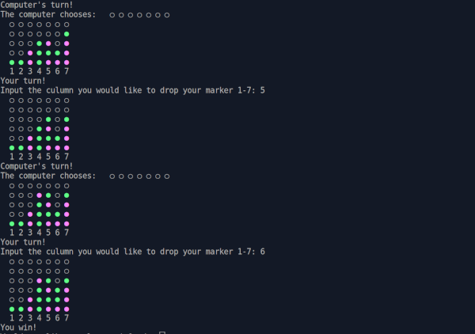

This project is my first chance to try test driven development with rspec and ruby to create a connect four game.

For board design, I was inspired by this example: https://replit.com/@thantko20/Connect-Four#main.rb

I think I might have written too many tests. I could see the benefit to having minimal tests that focus on the most important things. 

## Screenshots

